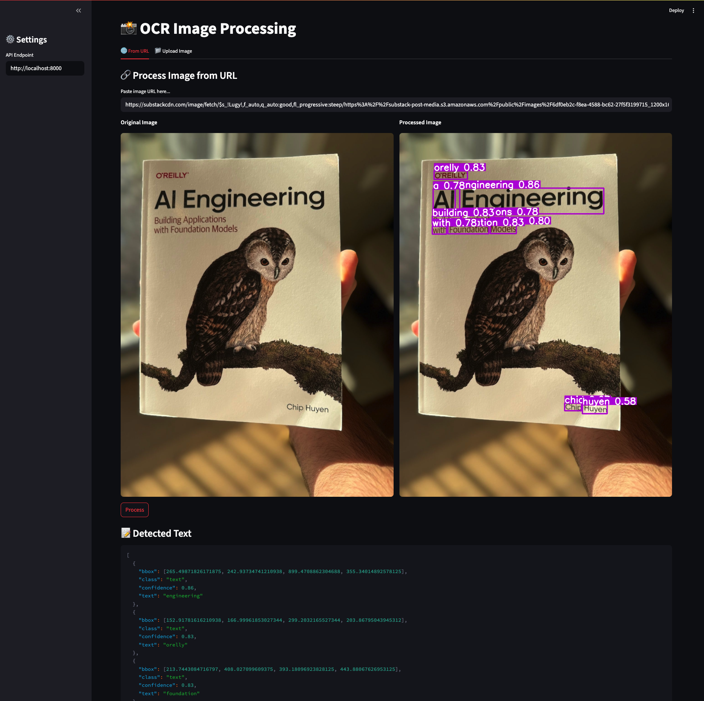

# Scene Text Detection OCR
An end-to-end OCR (Optical Character Recognition) pipeline that detects and transcribes text from images. Built with YOLOv11, CRNN, FastAPI, Ray Serve, and Streamlit, this project enables you to automate tasks by simply taking a photo and all relevent text info will be extracted automatically.


---

## 🔍 Features
- **Text Detection:** YOLOv11 model trained to find text regions
- **Text Recognition:** CRNN model with CTC decoding to transcribe each detected region
- **Streamlit Frontend:** Simple UI for processing images
- **FastAPI + Ray Serve:** Scalable backend for OCR processing

## 🚀 Quickstart

### 1. Create and Activate Virtual Environment

```bash
python -m venv .venv
source .venv/bin/activate
pip install -r requirements.txt
```

### 2. Run the Backend OCR Server

```bash
cd deployment
make init           # Start Ray cluster
make deploy_ocr     # Deploy the OCR server
```

### 3. Launch the Streamlit UI
```bash
make streamlit
```

Then you can:
- Open `http://localhost:8501` to test the UI
- Open `http://localhost:8265` to see the server dashboard
- Open `http://localhost:8000/docs` to access FastAPI Swagger UI

## 🖼️ Demo
